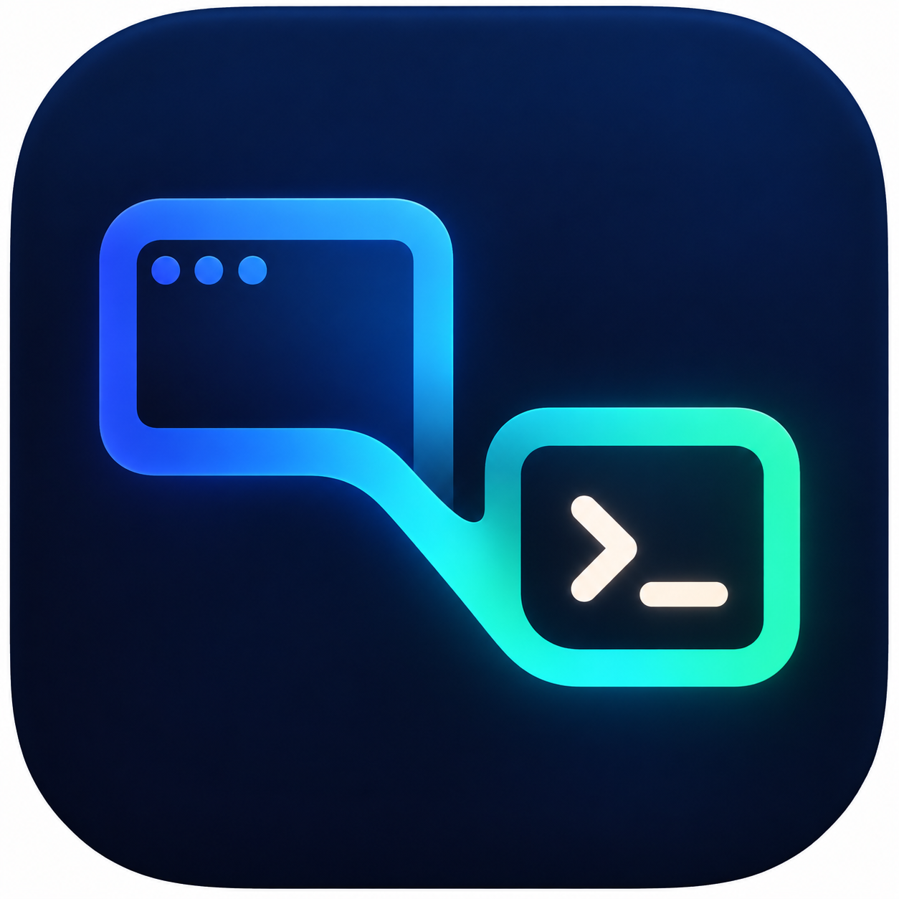
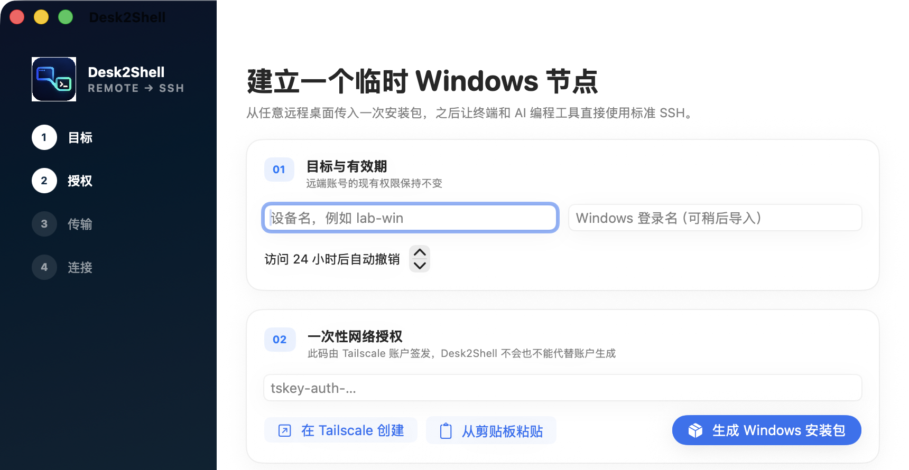

<p align="center">
  
</p>

# Desk2Shell

Desk2Shell turns one temporary remote-desktop session into a standard, temporary SSH connection to a Windows computer. The remote-desktop product is only used to transfer and launch the bootstrap package; afterwards Codex, Claude Code, terminals, and IDEs connect using normal SSH over the user's own Tailscale network.

> Status: **v0.1 developer preview**. The encrypted enrollment protocol, macOS controller, Windows bootstrap, expiry/revoke path, and build automation are implemented. The macOS app is distributed in a Developer ID signed and notarized DMG; the embedded Windows Bootstrap intentionally remains unsigned, and a clean Windows 10/11 test matrix has not yet been completed.

## Preview



_Desk2Shell 0.1.0 developer preview on macOS. Sensitive pairing information is outside the captured area._

## Product boundary

- Controller: macOS 14 or newer.
- Target: Windows 10 22H2 or Windows 11, local and Active Directory accounts.
- Microsoft Entra-only Windows accounts are rejected because Windows OpenSSH does not support public-key authentication for them.
- Networking: ordinary OpenSSH over the user's Tailscale network. No public port forwarding, exit node, subnet router, hosted control plane, or Tailscale SSH server.
- Transport: ToDesk, AnyDesk, TeamViewer, RustDesk, USB, or any other way to copy the setup ZIP.
- Access: the interactive Windows account that launches setup, with its existing permissions unchanged. Default lifetime is 24 hours.

## User flow

1. Open **Desk2Shell** on the Mac. It checks Tailscale and creates a dedicated, passphrase-protected Ed25519 key for this target.
2. Paste a one-off, non-ephemeral Tailscale Auth Key, choose a target name, and export the setup package.
3. Copy the ZIP to Windows, extract it, and run `Desk2Shell Bootstrap.exe`.
4. Paste the one-time pairing code shown on the Mac. The bootstrap captures the current interactive account before requesting UAC elevation.
5. The Windows bootstrap installs Tailscale/OpenSSH when needed, creates an isolated `Desk2ShellSSHD` service on port 2222, and schedules local expiry.
6. The Mac discovers the node, verifies `whoami`, and writes a managed SSH alias. Existing SSH configuration remains outside the managed block.
7. Use `ssh <alias>` or point an AI coding agent at that standard SSH alias.

The setup package contains no SSH private key. Its `.d2s` enrollment is AES-256-GCM encrypted, and the encryption key is the separate 256-bit pairing code. The Tailscale Auth Key is cleared after decryption and is invalid after successful use when the user created it as a one-off key.

## Build

Prerequisites:

- macOS with Xcode command-line tools / Swift 6
- .NET 8 SDK for Windows bootstrap release builds
- `zip`, `ssh-keygen`, and the Tailscale macOS app or CLI

```bash
./scripts/check.sh
./scripts/build-macos-app.sh
dotnet publish windows/Desk2Shell.Bootstrap/Desk2Shell.Bootstrap.csproj \
  -c Release -r win-x64 --self-contained true
```

For a complete unsigned developer bundle:

```bash
./scripts/package-release.sh
```

Public direct-download macOS releases use a Developer ID signed and notarized DMG with Sparkle automatic updates. The maintainer workflow and public identities are documented in [`docs/release.md`](docs/release.md). The `v0.1.0` developer preview intentionally carries an unsigned Windows Bootstrap, so Windows may show `Unknown publisher` or block it under managed security policy. Development artifacts remain labelled `UNSIGNED`.

## Repository layout

- `macos/Desk2ShellApp`: SwiftUI controller, Keychain integration, enrollment generation, discovery, and SSH configuration.
- `windows/Desk2Shell.Core`: versioned `.d2s` protocol and validation shared by the Windows UI and tests.
- `windows/Desk2Shell.Bootstrap`: WinForms bootstrap/status/revoke executable.
- `docs/enrollment-v1.md`: stable enrollment and local-state contracts.
- `scripts`: local build, package, and verification entrypoints.
- `legacy`: the original PowerShell proof of concept, retained for reference but not shipped.

## Security and operational notes

- Desk2Shell never uploads commands, file paths, usernames, IP addresses, device names, keys, or file contents.
- Optional telemetry is off until the controller user explicitly enables it. The open event schema is in `docs/telemetry.md`; no telemetry endpoint is enabled in developer builds.
- The target firewall rule is limited to the controller's Tailscale IPv4, the target's Tailscale IPv4, TCP 2222, and the Windows OpenSSH executable.
- Existing Tailscale identity, system `sshd` service, SSH configuration, and firewall rules are not modified. An already-connected target must be on the same tailnet recorded by the controller or setup stops.
- Revocation removes the dedicated service, scheduled task, firewall rule, host keys, and controller public key. If Desk2Shell enrolled Tailscale, it also logs the target out. Installed Tailscale/OpenSSH binaries are left in place to avoid destructive OS changes.
- No commercial redistribution of Tailscale is implied. The bootstrap downloads the official installer and verifies its Authenticode signature.

## Legacy CLI

The original proof-of-concept builder is available under `legacy/`. It embeds a Tailscale key in a ZIP and changes the system OpenSSH service, so it is intentionally not part of the product release path.

## License

Apache-2.0. See `LICENSE`.
