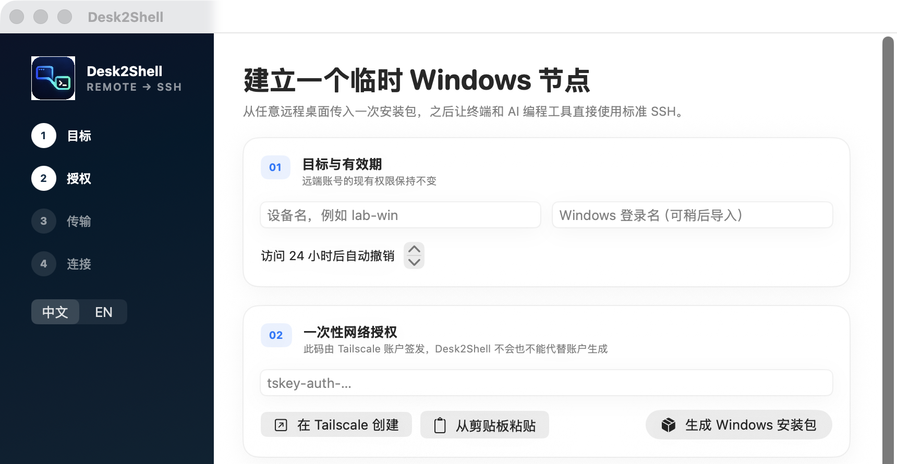

<p align="center">
  
</p>

<p align="center">
  <a href="README.md">English</a> · <strong>简体中文</strong>
</p>

# Desk2Shell

Desk2Shell 把一次临时远程桌面会话转换成面向 Windows 电脑的标准临时 SSH 连接。远程桌面工具只负责传输并启动 Bootstrap 安装包；之后 Codex、Claude Code、终端和 IDE 都通过用户自己的 Tailscale 网络使用普通 SSH 连接。

> 状态：**v0.1 开发者预览版**。加密 enrollment 协议、macOS 控制端、Windows Bootstrap、到期/撤销流程和构建自动化已经实现。macOS 应用通过 Developer ID 签名和 Apple 公证的 DMG 分发；内置的 Windows Bootstrap 目前有意保持未签名，干净的 Windows 10/11 测试矩阵尚未完成。

## 界面预览



_Desk2Shell v0.1.0 之后的 macOS 开发构建。截图范围不包含敏感配对信息。_

## 产品边界

- 控制端：macOS 14 或更高版本。
- 界面：macOS 控制端可在简体中文和英文之间切换。
- 目标端：Windows 10 22H2 或 Windows 11，支持本地账户和 Active Directory 账户。
- 不支持仅 Microsoft Entra 的 Windows 账户，因为 Windows OpenSSH 不支持这类账户的公钥认证。
- 网络：通过用户自己的 Tailscale 网络使用普通 OpenSSH。不使用公网端口转发、exit node、subnet router、托管控制平面或 Tailscale SSH server。
- 传输：可以使用 ToDesk、AnyDesk、TeamViewer、RustDesk、USB 或任何其他方式复制安装 ZIP。
- 权限：由启动安装程序的 Windows 交互账户执行，保持该账户原有权限不变。默认有效期为 24 小时。

## 使用流程

1. 在 Mac 上打开 **Desk2Shell**。应用会检查 Tailscale，并为该目标创建一把独立、带口令保护的 Ed25519 密钥。
2. 粘贴一个一次性、非 Ephemeral 的 Tailscale Auth Key，选择目标名称并导出安装包。
3. 把 ZIP 复制到 Windows，解压后运行 `Desk2Shell Bootstrap.exe`。
4. 粘贴 Mac 上显示的一次性配对码。Bootstrap 会先记录当前交互账户，再请求 UAC 提权。
5. Windows Bootstrap 会按需安装 Tailscale/OpenSSH，创建隔离的 `Desk2ShellSSHD` 服务并监听 2222 端口，同时安排本地到期任务。
6. Mac 发现目标节点，验证 `whoami`，并写入受管理的 SSH alias。现有 SSH 配置中受管理区块以外的内容保持不变。
7. 使用 `ssh <alias>`，或让 AI 编程工具连接这个标准 SSH alias。

安装包不包含 SSH 私钥。`.d2s` enrollment 使用 AES-256-GCM 加密，密钥来自独立的 256 位配对码。只要用户创建的是一次性 Auth Key，Tailscale Auth Key 在成功使用后就会失效，并在解密后从界面清除。

## 构建

前置条件：

- 安装了 Xcode Command Line Tools / Swift 6 的 macOS
- 用于构建 Windows Bootstrap Release 的 .NET 8 SDK
- `zip`、`ssh-keygen` 和 Tailscale macOS 应用或 CLI

```bash
./scripts/check.sh
./scripts/build-macos-app.sh
dotnet publish windows/Desk2Shell.Bootstrap/Desk2Shell.Bootstrap.csproj \
  -c Release -r win-x64 --self-contained true
```

生成完整的未签名开发包：

```bash
./scripts/package-release.sh
```

公开直连下载的 macOS 版本使用 Developer ID 签名、公证 DMG 和 Sparkle 自动更新。维护者流程与公开身份记录在 [`docs/release.md`](docs/release.md) 中。`v0.1.0` 开发者预览版内置的 Windows Bootstrap 有意保持未签名，因此 Windows 可能显示 `Unknown publisher`，也可能被受管理的安全策略阻止。开发构建仍会标记为 `UNSIGNED`。

## 仓库结构

- `macos/Desk2ShellApp`：SwiftUI 控制端、Keychain 集成、enrollment 生成、目标发现和 SSH 配置。
- `windows/Desk2Shell.Core`：Windows UI 和测试共用的版本化 `.d2s` 协议与校验逻辑。
- `windows/Desk2Shell.Bootstrap`：WinForms Bootstrap、状态和撤销程序。
- `docs/enrollment-v1.md`：稳定的 enrollment 和本地状态约定。
- `scripts`：本地构建、打包和验证入口。
- `legacy`：保留参考但不随产品发布的原始 PowerShell 概念验证。

## 安全与运行说明

- Desk2Shell 不会上传命令、文件路径、用户名、IP 地址、设备名、密钥或文件内容。
- 可选遥测默认关闭，只有控制端用户明确启用后才生效。开放事件结构位于 `docs/telemetry.md`；开发构建未配置遥测端点。
- 目标防火墙规则仅允许控制端 Tailscale IPv4 到目标 Tailscale IPv4、TCP 2222 和 Windows OpenSSH 可执行文件。
- 不修改现有 Tailscale 身份、系统 `sshd` 服务、SSH 配置和防火墙规则。已连接 Tailscale 的目标必须处于控制端记录的同一 tailnet，否则安装会停止。
- 撤销会移除独立服务、计划任务、防火墙规则、主机密钥和控制端公钥。如果 Tailscale 是由 Desk2Shell enrollment 完成的，也会让目标退出登录。为避免破坏系统，已安装的 Tailscale/OpenSSH 程序会保留。
- 不暗示对 Tailscale 的商业再分发。Bootstrap 下载官方安装程序并验证其 Authenticode 签名。

## 旧版 CLI

原始概念验证构建器位于 `legacy/`。它会在 ZIP 中嵌入 Tailscale 密钥并修改系统 OpenSSH 服务，因此不会进入当前产品发布路径。

## 许可证

Apache-2.0，参见 `LICENSE`。
